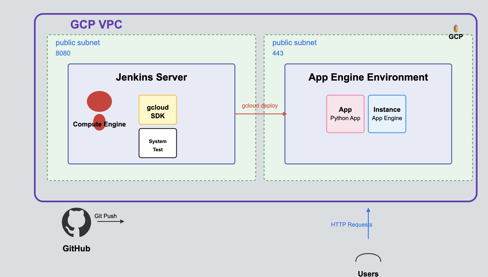

# Deployment Workload 2: CI/CD Pipeline with GCP App Engine

## PURPOSE
The purpose of this workload is to automate the deployment process of our application using Jenkins CI/CD pipeline and Google Cloud Platform (GCP) App Engine. This workload introduces automation through Jenkins pipelines and Google Cloud SDK tools, reducing manual intervention and improving deployment consistency and efficiency while leveraging GCP's managed services. The goal is to create a streamlined CI/CD process that enables faster and more reliable deployments to GCP App Engine.

## STEPS

1. **Cloned the repository to GitHub account**
   - This gives us a copy of the code to work with and enables source control for any changes made.

2. **Created Google Cloud Platform (GCP) Service Account**
   - Service accounts are essential for programmatic access to GCP services.
   - The service account allows Jenkins to interact with GCP services (like App Engine) without requiring manual login.
   - It's critical to keep these credentials secure as they provide direct access to GCP resources.

3. **Created a GCP Compute Engine VM instance for Jenkins Server**
   - Using Terraform to provision an e2-medium VM instance in GCP.
   - This provides the dedicated compute resources needed to run our Jenkins automation server.
   - Created within a custom VPC for better network isolation and security.

4. **Created system_resources_test.sh script**
   - This script monitors system resources (CPU, memory, disk) and returns appropriate exit codes.
   - Exit codes are crucial in CI/CD pipelines because they signal whether a step has passed or failed.
   - A failed test (exit code 1) can prevent deployment of code that might cause resource issues.

5. **Created a MultiBranch Pipeline and connected GitHub repository**
   - MultiBranch Pipelines automatically detect branches in our repository and run builds for each.
   - This enables feature branch development and continuous integration across all branches.
   - Pipeline configuration is automated through Terraform and startup scripts.

6. **Installed Google Cloud SDK on the Jenkins Server**
   - The Google Cloud SDK provides command-line access to GCP services from our Jenkins server.
   - This enables automation of GCP operations that previously required manual console interaction.

7. **Configured Jenkins user with necessary permissions**
   - Set up Jenkins with access to the GCP service account.
   - This allows Jenkins to run commands with the appropriate permissions on GCP.
   - Linked application default credentials to the Jenkins user.

8. **Navigated to the pipeline workspace**
   - This directory contains our application's source code as retrieved from our GitHub repository.
   - Working in this directory is essential for subsequent steps in the pipeline.

9. **Activated Python Virtual Environment**
   - Virtual environments isolate dependencies, preventing conflicts between different Python projects.
   - This environment is created during the build stage of our pipeline (via `python3 -m venv venv`).
   - Isolation ensures consistent builds across different environments and developers.

10. **Configured App Engine deployment**
    - Created app.yaml file that defines runtime environment, scaling, and resource allocation.
    - This configuration file replaces the Elastic Beanstalk configuration used previously.
    - Specified Python runtime, entrypoint, and health check settings.

11. **Added a deploy stage to the Jenkinsfile**
    - This automates the deployment process as part of our CI/CD pipeline.
    - The deploy stage runs after the test stage, ensuring we only deploy code that has passed tests.
    - It deploys the application to GCP App Engine using the gcloud command.

12. **Pushed changes to the GitHub repository**
    - This triggers our pipeline to run with the newly added deployment stage.
    - Source control tracks changes, providing versioning and rollback capabilities.

13. **Verified deployment in GCP Console**
    - Confirmed that the application was successfully deployed to App Engine.
    - Accessed the application at the App Engine-provided domain to ensure it's working.

## SYSTEM DESIGN DIAGRAM

## ISSUES/TROUBLESHOOTING

1. **Jenkins Pipeline Syntax Errors**
   - The Jenkinsfile syntax is very specific and sensitive to formatting errors.
   - Be sure to carefully follow the documentation to ensure proper stage definitions and bracket placement.
   - Solution: Reference the official Jenkins pipeline syntax documentation and validate the file.

2. **GCP Service Account Configuration**
   - Ensuring the Jenkins user had the proper GCP credentials configured was challenging.
   - Solution: Carefully follow the GCP authentication steps and verify with a simple command.
   - Make sure to grant the appropriate IAM roles to the service account.

3. **Python Virtual Environment Activation**
   - Issues with the virtual environment not being found or activated correctly can occur.
   - Solution: Make sure to use the correct path to the virtual environment and activation command.
   - Ensure proper environment setup in the Jenkinsfile.

4. **App Engine Deployment Failures**
   - Faced errors during initial App Engine deployment attempts.
   - Solution: Verified app.yaml configuration and ensured all required parameters were correctly specified.
   - Implemented proper health checks to validate deployment success.

## OPTIMIZATION

### How does a CI/CD pipeline to GCP increase business efficiency?

Migrating to GCP App Engine with a CI/CD pipeline dramatically increases business efficiency by:

1. **Reducing Manual Effort**: Deployments that previously required manual steps now happen automatically, freeing up developer time for more valuable tasks.

2. **Leveraging Managed Services**: GCP App Engine handles infrastructure management, allowing teams to focus on application development rather than server maintenance.

3. **Horizontal Scaling**: App Engine can automatically scale based on demand, eliminating the need to predict and provision resources in advance.

4. **Increasing Deployment Frequency**: The ease of automated deployments encourages more frequent, smaller updates, which reduces risk and gets features to users faster.

5. **Improving Consistency**: Every deployment follows the exact same process, eliminating human-induced variables and errors that can occur with manual deployments.

6. **Enabling Rapid Rollbacks**: If issues are detected, the pipeline can be configured to quickly roll back to a previous working version, minimizing downtime.

7. **Providing Deployment Traceability**: The pipeline records who initiated each deployment, what changes were included, and when it occurred, improving accountability and troubleshooting.

### Potential issues with automating deployments to production:

1. **Insufficient Testing**: Automated deployments might push untested or inadequately tested code to production if test coverage is poor.

2. **Security Vulnerabilities**: Without proper security gates, vulnerable code could be automatically deployed to production.

3. **Configuration Drift**: Differences between development and production environments can cause deployments to succeed in testing but fail in production.

4. **Credential Management**: CI/CD pipelines require access to production credentials, which increases security risk if not properly managed.

5. **Dependency on External Services**: If the pipeline relies on external services like GitHub or GCP, outages in those services can prevent deployments.

### How to address these issues:

1. **Implement Comprehensive Testing**: Include unit, integration, and security tests in the pipeline that must pass before deployment.

2. **Add Security Scanning**: Incorporate vulnerability scanning tools like OWASP dependency checks or SonarQube.

3. **Use Infrastructure as Code**: Define all environments using Terraform to ensure consistency between development and production.

4. **Implement Secret Management**: Use GCP Secret Manager to securely store and manage credentials.

5. **Create Approval Gates**: Add manual approval requirements for production deployments to maintain human oversight.

6. **Implement Feature Flags**: Use feature flags to gradually roll out changes to production users, limiting impact if issues occur.

7. **Set Up Monitoring and Alerting**: Implement robust monitoring with Cloud Monitoring to detect issues quickly after deployment, enabling fast response.

8. **Create Disaster Recovery Plans**: Document procedures for rolling back deployments and recovering from failures.

## CONCLUSION

This workload has successfully implemented a CI/CD pipeline for GCP App Engine. By leveraging Jenkins, Terraform, and Google Cloud SDK, we've created a streamlined process that reduces manual effort, increases consistency, and improves overall deployment efficiency.

The CI/CD pipeline we've implemented follows industry best practices by:
1. Retrieving code from a version-controlled repository
2. Building the application in an isolated environment
3. Running tests to verify functionality and resource utilization
4. Automatically deploying to App Engine when tests pass

This automation represents a significant improvement over manual deployment processes. It not only saves time but also reduces the potential for human error during the deployment process. The pipeline can be further enhanced by adding additional stages such as security scanning, performance testing, and staged deployments to different environments.

By continuing to refine and expand our GCP-based CI/CD pipeline, we can further improve our development velocity while maintaining application quality and reliability. The fully automated Jenkins setup script ensures consistent environment configuration, while Terraform provides reproducible infrastructure deployment.